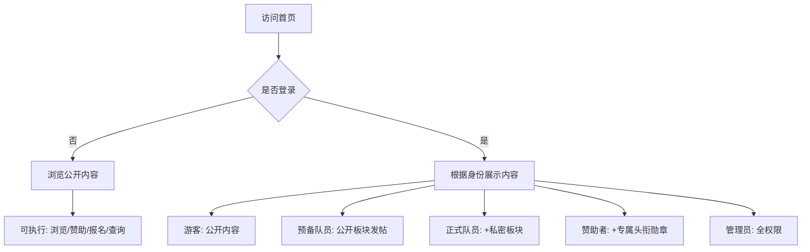
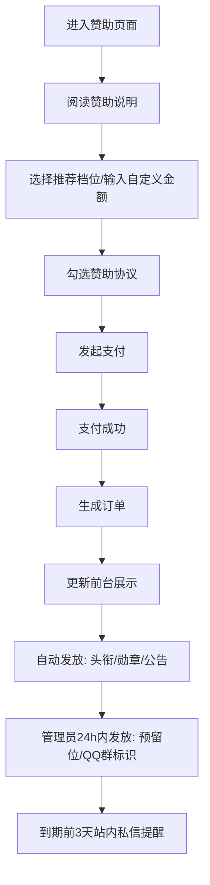
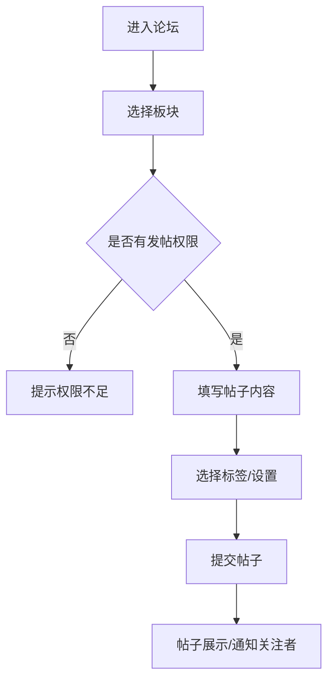
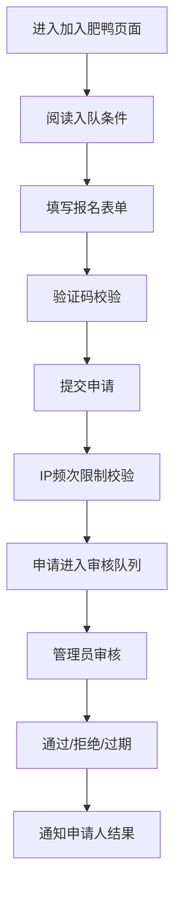

# 肥鸭战队(FY)官方社区网站 - 产品需求文档

## 1. 产品概述

肥鸭战队(FY)官方社区网站是面向《战术小队》游戏玩家的五位一体综合服务平台，集品牌展示、队员交流论坛、服务器状态监控、新手科普教学、自愿赞助功能于一体，打造专业、公平、透明的游戏社区生态。

## 2. 核心功能

### 2.1 用户角色

| 角色 | 注册方式 | 核心权限 |
|------|---------|---------|
| 游客 | 无需注册 | 浏览公开页面、查看服务器状态、赞助 |
| 预备队员 | QQ登录/注册 | 浏览公开板块、发帖回帖 |
| 正式队员 | 管理员审核通过 | 预备队员权限 + 访问私密板块、参与队内活动 |
| 赞助者 | 支付赞助 | 对应档位头衔/勋章 + 正式队员全部权限 |
| 管理员 | 后台分配 | 全权限，管理板块、帖子、用户、内容 |

### 2.2 功能模块

1. **首页**: 导航栏、轮播图、服务器状态预览、赞助之星榜单、最新动态、快捷入口
2. **关于肥鸭**: 战队简介、发展史时间轴、管理团队、荣誉墙、规章制度
3. **肥鸭论坛**: 多板块论坛、发帖回帖、楼中楼、点赞收藏、搜索、权限隔离
4. **加入肥鸭**: 入队条件、在线报名表单、申请进度查询、新人FAQ
5. **FY服务器**: 服务器状态卡片、一键进服、维护预告、黑名单查询、趣味数据
6. **赞助我们**: 推荐档位、自定义金额、支付接口、赞助榜单、收支公示
7. **游戏科普**: 新手入门、官方资讯、版本更新、常见问题
8. **肥鸭战术库**: 图文攻略、教学视频、资源下载、战术投稿
9. **赛事活动**: 活动预告、在线报名、赛程展示、赛果公示
10. **战队相册&视频**: 分类相册、在线预览、分页加载
11. **联系我们**: QQ群、邮箱、问题反馈表单
12. **友情链接**: 友好战队、资源站链接
13. **404页面**: 军事风格错误页
14. **个人中心**: 资料、动态、赞助记录、收藏、账号设置
15. **站内消息**: 系统通知、互动通知、招募通知、免打扰设置

### 2.3 页面详情

| 页面名称 | 模块名称 | 功能描述 |
|---------|---------|---------|
| 首页 | 顶部导航栏 | 固定悬浮，含LOGO、菜单、用户入口；移动端折叠为汉堡菜单 |
| 首页 | 全站公告栏 | 固定展示重要公告，支持关闭 |
| 首页 | 宣传轮播图 | 战队风采、招募公告、服务器活动，自动切换+手动控制 |
| 首页 | 赞助滚动公告 | 实时展示最新赞助，点击跳转赞助页面 |
| 首页 | 服务器状态预览 | 卡片展示状态灯、在线人数、地图，30秒自动刷新 |
| 首页 | 赞助之星榜单 | TOP3-TOP5金色样式，按月累计赞助金额排名 |
| 首页 | 快捷功能入口 | 论坛、加入、服务器、赞助等核心功能快捷入口 |
| 首页 | 战队数据概览 | 累计发帖、队员数、服务器运行天数等统计 |
| 首页 | 最新动态 | 论坛新帖、官方公告、活动预告聚合展示 |
| 首页 | 活跃度榜单 | 论坛发帖、活动参与排行 |
| 首页 | 回到顶部按钮 | PC/移动端通用悬浮按钮 |
| 首页 | 页脚 | 访问量、版权、友情链接入口 |
| 关于肥鸭 | 战队简介 | 发展理念与核心价值观展示 |
| 关于肥鸭 | 发展史 | 时间轴展示里程碑事件 |
| 关于肥鸭 | 管理团队 | 职务、ID、负责板块介绍 |
| 关于肥鸭 | 荣誉墙 | 赛事奖项、战队成就展示 |
| 关于肥鸭 | 规章制度 | 完整战队规则、队员行为规范 |
| 肥鸭论坛 | 板块列表 | 9大板块展示，含帖子数、最新回复 |
| 肥鸭论坛 | 帖子列表 | 分页加载，区分新帖/已读帖、精华/置顶标识 |
| 肥鸭论坛 | 帖子详情 | 楼主内容、分页回复、楼中楼、@用户、阅读进度 |
| 肥鸭论坛 | 发帖/编辑 | 富文本编辑器、标签选择、板块选择 |
| 肥鸭论坛 | 侧边栏 | 热门帖子榜单、板块导航、用户信息 |
| 加入肥鸭 | 入队说明 | 条件、流程、联系方式 |
| 加入肥鸭 | 报名表单 | 游戏ID、时长、兵种、QQ、自我介绍 |
| 加入肥鸭 | 进度查询 | 支持游戏ID/QQ查询申请状态 |
| 加入肥鸭 | 新人指南 | FAQ、考核标准、注意事项 |
| FY服务器 | 服务器卡片 | 名称、状态灯、在线/排队人数、地图、IP/端口、EAC状态 |
| FY服务器 | 一键进服 | steam://connect 协议跳转 |
| FY服务器 | 维护预告 | 停机时间、恢复时长、补时规则公示 |
| FY服务器 | 趣味数据 | 当日最高在线、本周热门地图、玩家时长排行 |
| FY服务器 | 黑名单查询 | 封禁状态、原因、时长、解封时间 |
| FY服务器 | 24小时趋势图 | 在线人数折线图 |
| 赞助我们 | 赞助说明 | 成本用途、公平声明、退款提醒 |
| 赞助我们 | 推荐档位 | 基础/标准/高级/至尊四档展示 |
| 赞助我们 | 自定义金额 | 输入框+支付按钮，双重校验 |
| 赞助我们 | 支付流程 | 协议弹窗、微信/支付宝双接口 |
| 赞助我们 | 赞助榜单 | 金/银/铜分级榜单，累计金额排名 |
| 赞助我们 | 收支公示 | 月度明细、凭证、运营简报 |
| 游戏科普 | 新手入门 | 下载、操作、兵种、术语、设置 |
| 游戏科普 | 官方资讯 | 版本更新、赛事新闻汇总 |
| 肥鸭战术库 | 图文攻略 | 分地图战术、点位标注 |
| 肥鸭战术库 | 教学视频 | 视频播放、对局回放 |
| 肥鸭战术库 | 资源下载 | 插件、语音包、优化设置，防爬验证 |
| 肥鸭战术库 | 战术投稿 | 队员提交、管理员审核 |
| 赛事活动 | 活动预告 | 活动/赛事信息展示 |
| 赛事活动 | 在线报名 | 表单填写、管理员审核 |
| 赛事活动 | 赛程展示 | 分组对阵、时间线 |
| 赛事活动 | 赛果公示 | 战报、图文/视频回顾 |
| 战队相册 | 相册列表 | 分类展示、分页加载 |
| 战队相册 | 视频库 | 在线预览、下载 |
| 联系我们 | 联系方式 | QQ群、邮箱、管理员 |
| 联系我们 | 问题反馈 | 表单、附件、验证码+IP防刷 |
| 个人中心 | 个人资料 | 游戏ID、身份、头像、头衔/勋章 |
| 个人中心 | 我的动态 | 发帖、评论记录 |
| 个人中心 | 我的赞助 | 订单、生效/到期时间、剩余天数 |
| 个人中心 | 账号设置 | 密码修改、消息偏好、QQ登录同步 |
| 个人中心 | 我的收藏 | 战术、视频、资源收藏列表 |
| 站内消息 | 消息列表 | 标签分类、已读/未读标记、一键已读 |
| 站内消息 | 免打扰设置 | 分组设置免打扰时段 |

## 3. 核心流程

### 3.1 用户访问流程

### 3.2 赞助流程

### 3.3 论坛发帖流程

### 3.4 入队申请流程

## 4. 用户界面设计

### 4.1 设计风格

- **主色调**: 暖黄色 `#FFD166` - 导航栏、核心按钮、板块标题、LOGO、重点高亮
- **基础底色**: 深灰色 `#2D3142` - 页面主背景、侧边栏、卡片底色、正文文字
- **军事点缀色**: 军绿色 `#3E5641` - 模块边框、分割线、功能小图标
- **功能强调色**: 橙色 `#F26419` - 行动按钮、排队人数、系统提醒
- **赞助等级色**: 铜牌 `#B87333`、银牌 `#C0C0C0`、金牌 `#FFD700`
- **服务器状态色**: 在线 `#4CAF50`、负载高 `#FFC107`、离线 `#F44336`

- **按钮风格**: 微直角设计，军事硬朗风格；hover色彩变化；禁用态置灰
- **字体**: 思源黑体（无衬线），标题加粗，正文标准字号，辅助文字缩小+降低透明度
- **布局**: 卡片式布局，合理留白，低透明度(12%)迷彩纹理背景
- **图标**: 扁平化/线性军事图标（战术头盔、枪械、地图、对讲机、军衔等）

### 4.2 页面设计概览

| 页面名称 | 模块名称 | UI元素 |
|---------|---------|--------|
| 首页 | 导航栏 | 深灰底色，暖黄LOGO/高亮，微直角按钮 |
| 首页 | 轮播图 | 全宽展示，底部指示器，左右切换箭头 |
| 首页 | 服务器卡片 | 状态灯(圆形)、数据横向排列，军绿边框 |
| 首页 | 赞助之星 | 金色边框/背景，前三名皇冠图标 |
| 首页 | 快捷入口 | 图标+文字卡片，hover暖黄高亮 |
| 论坛 | 板块列表 | 左侧图标+名称+帖子数，右侧最新回复 |
| 论坛 | 帖子列表 | 标题+作者/时间/回复数，新帖暖黄标识 |
| 论坛 | 帖子详情 | 楼主卡片高亮，回复楼层编号，楼中楼缩进 |
| 服务器 | 状态卡片 | 大状态灯，关键数据加粗，一键进服按钮 |
| 服务器 | 趋势图 | 折线图，时间轴，数据点提示 |
| 赞助 | 档位卡片 | 四档并列，权益列表勾选标识，推荐档位突出 |
| 赞助 | 自定义金额 | 输入框+确认按钮，错误提示 |
| 个人中心 | 资料卡 | 头像+基本信息+头衔勋章横向排列 |
| 个人中心 | 标签页 | 动态/赞助/收藏/设置切换 |

### 4.3 响应式适配

- **PC端**: 完整布局，侧边栏展示，多列排列
- **平板端**: 中等宽度，部分模块双列变单列，导航保持展开
- **移动端**: 单列布局，导航折叠为汉堡菜单，按钮尺寸适配触摸，悬浮按钮常驻

### 4.4 动画与交互

- **必要动效**: 按钮hover色彩变化(0.2s ease)、页面平滑滚动、轮播/公告无缝滚动
- **禁用特效**: 悬浮特效、粒子特效、复杂转场
- **加载状态**: 数据刷新时骨架屏或loading动画
- **反馈交互**: 操作成功/失败toast提示，表单错误即时校验
