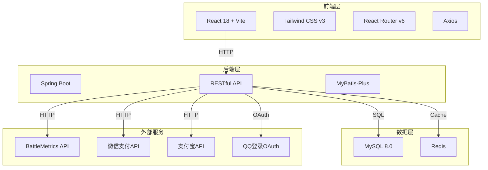
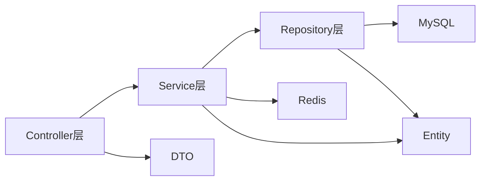
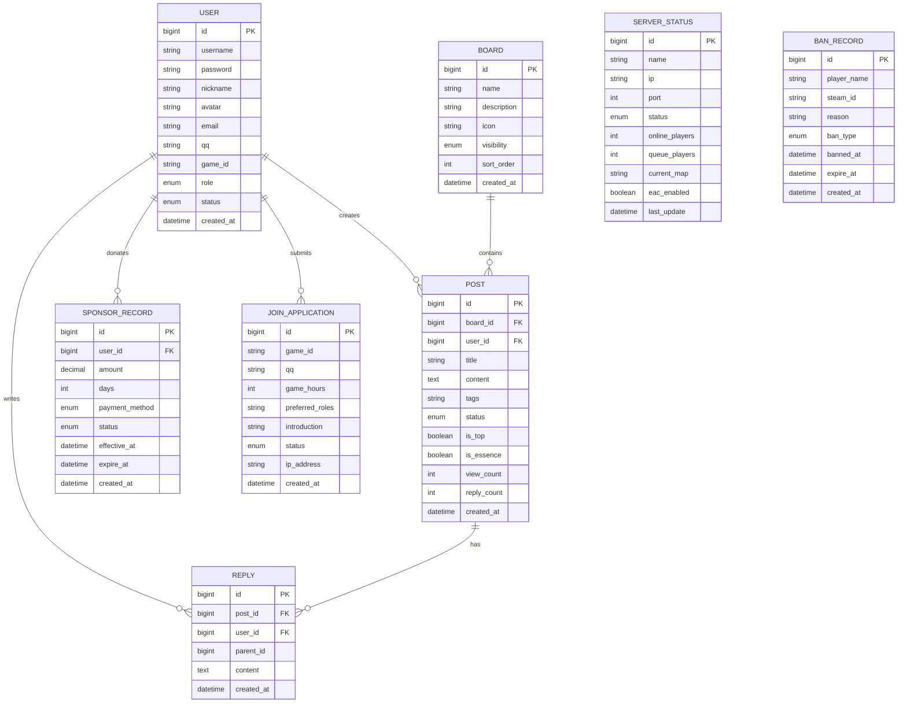

# 肥鸭战队(FY)官方社区网站 - 技术架构文档

## 1. 架构设计



## 2. 技术描述

- **前端框架**: React@18 + Vite
- **CSS框架**: Tailwind CSS v3
- **路由**: React Router v6
- **HTTP客户端**: Axios
- **图标**: Lucide React (军事风格图标)
- **图表**: Chart.js / Recharts (服务器数据趋势图)
- **轮播**: Swiper / Embla Carousel
- **后端框架**: Spring Boot 3.x
- **ORM**: MyBatis-Plus
- **数据库**: MySQL 8.0
- **缓存**: Redis
- **安全**: Spring Security, JWT

## 3. 路由定义

| 路由 | 用途 |
|------|------|
| / | 首页 |
| /about | 关于肥鸭 |
| /forum | 肥鸭论坛首页 |
| /forum/:boardId | 板块帖子列表 |
| /forum/post/:postId | 帖子详情 |
| /forum/new | 发布新帖 |
| /join | 加入肥鸭 |
| /join/apply | 在线报名 |
| /join/status | 申请进度查询 |
| /server | FY服务器专区 |
| /sponsor | 赞助我们 |
| /guide | 游戏科普 |
| /tactics | 肥鸭战术库 |
| /events | 赛事活动 |
| /gallery | 战队相册&视频 |
| /contact | 联系我们 |
| /links | 友情链接 |
| /profile | 个人中心 |
| /messages | 站内消息 |
| /login | 登录页 |
| /register | 注册页 |
| /404 | 错误页面 |

## 4. API定义

### 4.1 用户相关

```typescript
// 用户登录
POST /api/auth/login
Request: { username: string, password: string, captcha: string }
Response: { token: string, user: UserInfo }

// QQ登录
GET /api/auth/qq/callback
Response: { token: string, user: UserInfo }

// 获取当前用户
GET /api/user/me
Response: UserInfo

// 更新用户信息
PUT /api/user/profile
Request: { nickname: string, avatar: string, gameId: string }
Response: UserInfo
```

### 4.2 论坛相关

```typescript
// 获取板块列表
GET /api/forum/boards
Response: Board[]

// 获取帖子列表
GET /api/forum/posts?boardId=&page=&size=
Response: { list: Post[], total: number }

// 获取帖子详情
GET /api/forum/posts/:id
Response: PostDetail

// 发布帖子
POST /api/forum/posts
Request: { boardId: number, title: string, content: string, tags: string[] }
Response: Post

// 发布回复
POST /api/forum/posts/:id/replies
Request: { content: string, parentId?: number }
Response: Reply
```

### 4.3 服务器相关

```typescript
// 获取服务器状态
GET /api/server/status
Response: { servers: ServerStatus[], updateTime: string }

// 获取24小时趋势
GET /api/server/trend?serverId=
Response: { timestamps: string[], playerCounts: number[] }

// 获取黑名单
GET /api/server/bans?page=&size=
Response: { list: BanRecord[], total: number }
```

### 4.4 赞助相关

```typescript
// 创建赞助订单
POST /api/sponsor/orders
Request: { amount: number, paymentMethod: 'wechat' | 'alipay' }
Response: { orderId: string, paymentUrl: string }

// 查询赞助记录
GET /api/sponsor/records
Response: SponsorRecord[]

// 获取赞助榜单
GET /api/sponsor/rankings?type=month|total
Response: { list: SponsorRanking[], updateTime: string }
```

## 5. 服务端架构



## 6. 数据模型

### 6.1 ER图



### 6.2 数据定义

```sql
-- 用户表
CREATE TABLE `user` (
  `id` bigint NOT NULL AUTO_INCREMENT,
  `username` varchar(50) NOT NULL,
  `password` varchar(255) DEFAULT NULL,
  `nickname` varchar(50) DEFAULT NULL,
  `avatar` varchar(255) DEFAULT NULL,
  `email` varchar(100) DEFAULT NULL,
  `qq` varchar(20) DEFAULT NULL,
  `game_id` varchar(50) DEFAULT NULL,
  `role` enum('guest','probation','member','sponsor','admin') DEFAULT 'guest',
  `status` enum('active','banned','inactive') DEFAULT 'active',
  `created_at` datetime DEFAULT CURRENT_TIMESTAMP,
  `updated_at` datetime DEFAULT CURRENT_TIMESTAMP ON UPDATE CURRENT_TIMESTAMP,
  PRIMARY KEY (`id`),
  UNIQUE KEY `uk_username` (`username`),
  UNIQUE KEY `uk_qq` (`qq`)
) ENGINE=InnoDB DEFAULT CHARSET=utf8mb4;

-- 板块表
CREATE TABLE `board` (
  `id` bigint NOT NULL AUTO_INCREMENT,
  `name` varchar(50) NOT NULL,
  `description` varchar(255) DEFAULT NULL,
  `icon` varchar(50) DEFAULT NULL,
  `visibility` enum('public','member','admin') DEFAULT 'public',
  `sort_order` int DEFAULT 0,
  `created_at` datetime DEFAULT CURRENT_TIMESTAMP,
  PRIMARY KEY (`id`)
) ENGINE=InnoDB DEFAULT CHARSET=utf8mb4;

-- 帖子表
CREATE TABLE `post` (
  `id` bigint NOT NULL AUTO_INCREMENT,
  `board_id` bigint NOT NULL,
  `user_id` bigint NOT NULL,
  `title` varchar(200) NOT NULL,
  `content` text NOT NULL,
  `tags` varchar(255) DEFAULT NULL,
  `status` enum('normal','deleted','banned') DEFAULT 'normal',
  `is_top` tinyint(1) DEFAULT 0,
  `is_essence` tinyint(1) DEFAULT 0,
  `view_count` int DEFAULT 0,
  `reply_count` int DEFAULT 0,
  `created_at` datetime DEFAULT CURRENT_TIMESTAMP,
  `updated_at` datetime DEFAULT CURRENT_TIMESTAMP ON UPDATE CURRENT_TIMESTAMP,
  PRIMARY KEY (`id`),
  KEY `idx_board_id` (`board_id`),
  KEY `idx_user_id` (`user_id`)
) ENGINE=InnoDB DEFAULT CHARSET=utf8mb4;

-- 回复表
CREATE TABLE `reply` (
  `id` bigint NOT NULL AUTO_INCREMENT,
  `post_id` bigint NOT NULL,
  `user_id` bigint NOT NULL,
  `parent_id` bigint DEFAULT NULL,
  `content` text NOT NULL,
  `created_at` datetime DEFAULT CURRENT_TIMESTAMP,
  PRIMARY KEY (`id`),
  KEY `idx_post_id` (`post_id`),
  KEY `idx_user_id` (`user_id`)
) ENGINE=InnoDB DEFAULT CHARSET=utf8mb4;

-- 赞助记录表
CREATE TABLE `sponsor_record` (
  `id` bigint NOT NULL AUTO_INCREMENT,
  `user_id` bigint DEFAULT NULL,
  `amount` decimal(10,2) NOT NULL,
  `days` int NOT NULL,
  `payment_method` enum('wechat','alipay') DEFAULT NULL,
  `status` enum('pending','paid','cancelled') DEFAULT 'pending',
  `effective_at` datetime DEFAULT NULL,
  `expire_at` datetime DEFAULT NULL,
  `created_at` datetime DEFAULT CURRENT_TIMESTAMP,
  PRIMARY KEY (`id`),
  KEY `idx_user_id` (`user_id`)
) ENGINE=InnoDB DEFAULT CHARSET=utf8mb4;

-- 入队申请表
CREATE TABLE `join_application` (
  `id` bigint NOT NULL AUTO_INCREMENT,
  `game_id` varchar(50) NOT NULL,
  `qq` varchar(20) NOT NULL,
  `game_hours` int DEFAULT 0,
  `preferred_roles` varchar(255) DEFAULT NULL,
  `introduction` text,
  `status` enum('pending','approved','rejected','expired') DEFAULT 'pending',
  `ip_address` varchar(50) DEFAULT NULL,
  `created_at` datetime DEFAULT CURRENT_TIMESTAMP,
  `updated_at` datetime DEFAULT CURRENT_TIMESTAMP ON UPDATE CURRENT_TIMESTAMP,
  PRIMARY KEY (`id`),
  KEY `idx_game_id` (`game_id`),
  KEY `idx_qq` (`qq`)
) ENGINE=InnoDB DEFAULT CHARSET=utf8mb4;

-- 服务器状态表
CREATE TABLE `server_status` (
  `id` bigint NOT NULL AUTO_INCREMENT,
  `name` varchar(100) NOT NULL,
  `ip` varchar(50) NOT NULL,
  `port` int NOT NULL,
  `status` enum('online','high_load','offline') DEFAULT 'offline',
  `online_players` int DEFAULT 0,
  `queue_players` int DEFAULT 0,
  `current_map` varchar(100) DEFAULT NULL,
  `eac_enabled` tinyint(1) DEFAULT 1,
  `last_update` datetime DEFAULT CURRENT_TIMESTAMP,
  PRIMARY KEY (`id`)
) ENGINE=InnoDB DEFAULT CHARSET=utf8mb4;

-- 黑名单表
CREATE TABLE `ban_record` (
  `id` bigint NOT NULL AUTO_INCREMENT,
  `player_name` varchar(100) DEFAULT NULL,
  `steam_id` varchar(50) DEFAULT NULL,
  `reason` varchar(255) DEFAULT NULL,
  `ban_type` enum('temporary','permanent') DEFAULT 'temporary',
  `banned_at` datetime DEFAULT CURRENT_TIMESTAMP,
  `expire_at` datetime DEFAULT NULL,
  PRIMARY KEY (`id`),
  KEY `idx_steam_id` (`steam_id`)
) ENGINE=InnoDB DEFAULT CHARSET=utf8mb4;

-- 消息通知表
CREATE TABLE `notification` (
  `id` bigint NOT NULL AUTO_INCREMENT,
  `user_id` bigint NOT NULL,
  `type` enum('system','interaction','recruit') DEFAULT 'system',
  `title` varchar(200) NOT NULL,
  `content` text,
  `is_read` tinyint(1) DEFAULT 0,
  `created_at` datetime DEFAULT CURRENT_TIMESTAMP,
  PRIMARY KEY (`id`),
  KEY `idx_user_id` (`user_id`)
) ENGINE=InnoDB DEFAULT CHARSET=utf8mb4;
```
